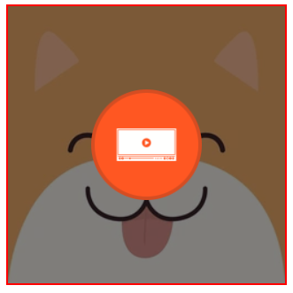
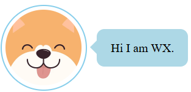
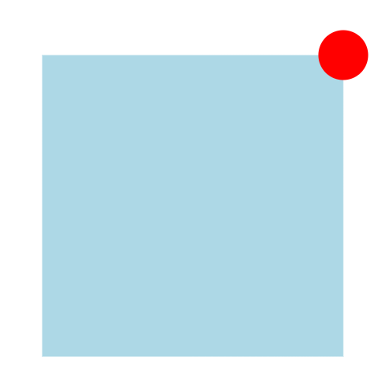

# CSS Positioning & Stacking Context

property: `position` sets how an element is positioned in a document.

| Prop     | Description                                                                                                                                      |
| -------- | ------------------------------------------------------------------------------------------------------------------------------------------------ |
| static   | positioned according to the normal document flow. (default)                                                                                      |
| relative | same as static but is offset relative to itself based on the values of `top`, `right`, `bottom`, and `left`.                                     |
| absolute | remove from document flow and is positioned relative to the nearest positioned ancestor or the initial containing block (the whole webpage html) |
| fixed    | remove from the document flow and is positioned relative to the initial containing block (html).                                                 |
| sticky   | based on the document flow and is positioned relative to the nearest scrolling ancestor (body) and nearest block-level ancestor.                 |


## 1. Relative

- values:
    - top: specify the distance between the top edge (count margin in) of the element and the inner border of the top edge of its containing block (in  this case, itself).
    - left: for left edge.
    - bottom: for bottom edge.
    - right: for right edge.

- value can be negative.

## 2. Absolute

### Seven features:
- a. get out of the document flow.
- b. positioned relative the closest positioned ancestor (relative, absolute, fixed, sticky...) to the element.
- c. when parent element and ancestor element do not have position set, the current element will be placed relative to the body element.
- d. Set position on inline box makes them to behave like inline-block box, supporting setting size (width and height).
- e. `margin: 0 auto` horizontal centering is not working.
- f. Set `top`, `bottom`, `right` and `left` simultaneously to adjust element size when the element size is not yet set.
- g. Precedence of top, bottom, left and right when the size of current element is set.
  - `top` and `left` will work, `bottom` and `right` will not work.
  - and vice versa.

Note: It's possible to have absolute positioned element inside absolute positioned element.

### Applications

- create cover, overlay effect.
- work with JS to implement animation.
- etc...

#### 1. Centering

```css
/* Horizontal Centering */
left: 50%;
/* Move half of its wito the left by 50px */
margin-left: -50px;

/* Vertical Centering */
top: 50%;
/* Move half of its heito the top by 50px */
margin-top: -50px;
```

#### 2. Overlay Effect


#### 3. Implement Chatbox


## 3. Fixed

- similar to **absolute** but it is positioned relative to the initial containing block (browser window / viewport).
- Special case: when an ancestor of a fixed-positioned element has `transform`, `perspective`, `filter` or `backdrop-filter` set to a value other than `none`,  the fixed-positioned element will be positioned relative to that ancestor instead of the viewport.
-values: `top`, `bottom`, `left`, `right`
### Cases
#### 1. Relative to viewport
#### 2. Relative to ancestor
-  when an ancestor of a fixed-positioned element has `transform`, `perspective`, `filter` or `backdrop-filter` set to a value other than `none`


```css
.box {
  width: 300px;
  height: 300px;
  background-color: lightblue;
  position: fixed;
  top: 50%;
  left: 50%;
  /* margin-top: -150px;
  margin-left: -150px; */
            
  /* Move to left and top by halfcurrent element size. */
  transform: translate(-50%, -50%);
}

.box .close {
  width: 50px;
  height: 50px;
  background-color: red;
  border-radius: 50%;
  /* Default: positioned relative viewport. */
  /* What if we want it to be positioned to .box? */
  /* Use transform on .box */
  /* It will positioned relative to .instead of the viewport. */
  position: fixed;
  top: -25px;
  right: -25px;
}
```
Note: In real world project, we use positioned absolute to achieve this. But, this might help you understand the reasons behind some edge cases when you realize that your fixed-positioned element is not positioned relative to viewport.

### Applications

#### 1. Back to Top

#### 2. Pop-up Window

#### 3. Three-Column Layout

## 4. Sticky