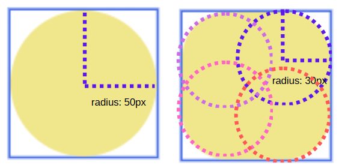
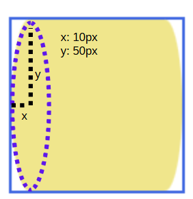
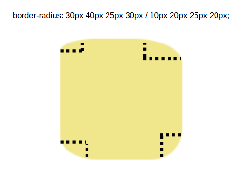

# Border Radius, Box Shadow, Text Shadow & CSS Functions

[TOC]

## 1. Border Radius

- a shorthand property that is used to round the corners of the element border.

### a. Circle Corners



### b. Ellipse Corners

- ellipse has major axis and minor axis.
- `border-radius: x / y;` where x is the horizontal radius and y is vertical.




### Values:

> Behaviour when overlapping radii happens: https://drafts.csswg.org/css-backgrounds/#corner-overlap

Cirle:

1. one value: `border-radius: 50px;`
- for all four corners.
1. two values: `border-radius: 25px 50px;`
- v1: top-left & bottom-right
- v2: top-right & bottom-left;
1. three values: `border-radius: 20px 50px 30px;`
- v1: top-left
- v2: top-right & bottom-left
- v3: bottom-right
1. four values: `border-radius: 10px 20px 30px 40px;`
- v1: top-left
- v2: top-right
- v3: bottom-right
- v4: bottom-left

Ellipse:
> each value in ellipse is written in the form of x / y.
> > - x: horizontal radius
> > - y: vertical radius

> refers to circle to understand what each value represents.
1. one value: `border-radius: 25px / 50px;`
2. two values: `border-radius: 25px 30px / 20px 40px;`
3. three values: `border-radius: 25px 40px 20px / 30px 20px 10px;`
4. four values: `border-radius: 10px 20px 30px 40px / 40px 30px 20px 10px;`




**absolute value (px)**
> refers to the radius of circle.

**Percentage (%)**
> refers to the radii of ellipse, regardless you write it as `single percentage value` or `x / y format`.
> You should consider the horizontal and vertical radius of the ellipse.
> visible size = size (width / height) + padding + border
- relative to the visible size (width / height) of the current element.
- `horizontal radius = (width + padding + border) * percentage`
- `vertical radius = (height + padding + border) * percentage`

```css
border-radius: 20%;
border-radius: 50% / 100%; /* x / y format */
```

**Drawing Circle**
- an element is a square where width and height is the same.
- border-radius is half the size.
- horizontal & vertical radius are the same.
```css
/* let say width: 50px; height 50px */

/* Note: value > 50% is the same as 50%. */
/*  */
border-radius: 50%; 
/* OR */
border-radius: 25px; /* radius = 50px / 2 */

```

**Drawing Semi-Circle**

```css
.box {
    width: 200px;
    height: 100px;
    background-color: tomato;
    /* Note: This code might not works as expected. */
    /* Reason: % will look for horizontal & vertical radius! */
    /* border-radius: 50% 50% 0 0; */

    /*
    horizontal radius: 200 * 50% = 100px
    vertical radius: 100 * 50% = 50px

    So, we must make sure the vertical radius is the same ahorizontal radius
    We use 100% for vertical radius instead.
    */
    border-radius: 50% 50% 0 0 / 100% 100% 0 0;
}
```

**Individual Properties**
> used to override specific corners.
> based on cascading.
- `border-top-left-radius`
- `border-top-right-radius`
- `border-bottom-left-radius`
- `border-bottom-right-radius`

## Box Shadow